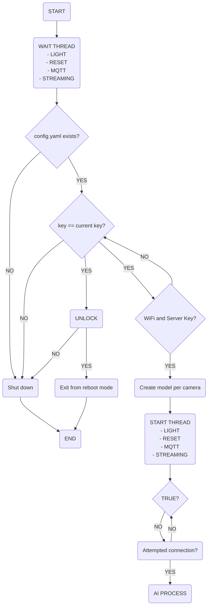

```mermaid
    graph TD;
        A(START) --> B(WAIT THREAD<br>- LIGHT<br>- RESET<br>- MQTT<br>- STREAMING);
        B --> C{config.yaml exists?};
        C -- NO --> D(Shut down);
        D --> E(END);
        C -- YES --> F{key == current key?};
        F -- NO --> D;
        F -- YES --> G{WiFi and Server Key?};
        G -- NO --> F;
        G -- YES --> H(Create model per camera);
        H --> I(START THREAD<br>- LIGHT<br>- RESET<br>- MQTT<br>- STREAMING);
        I --> J{TRUE?};
        J -- NO --> K(Attempted connection?);
        K -- NO --> J;
        K -- YES --> L(AI PROCESS);
        F -- YES --> M(UNLOCK);
        M -- NO --> D;
        M -- YES --> N(Exit from reboot mode);
        N --> E;
```